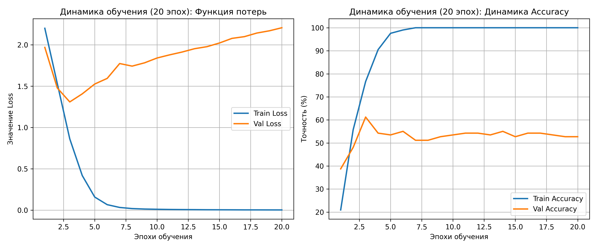
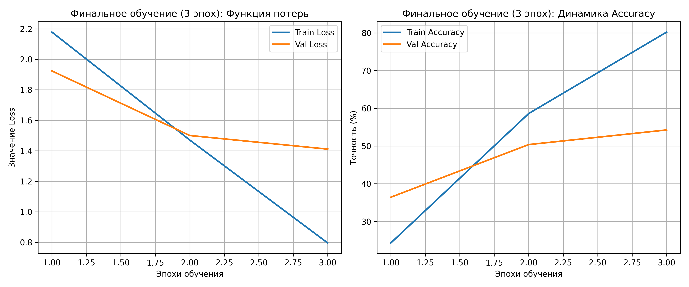
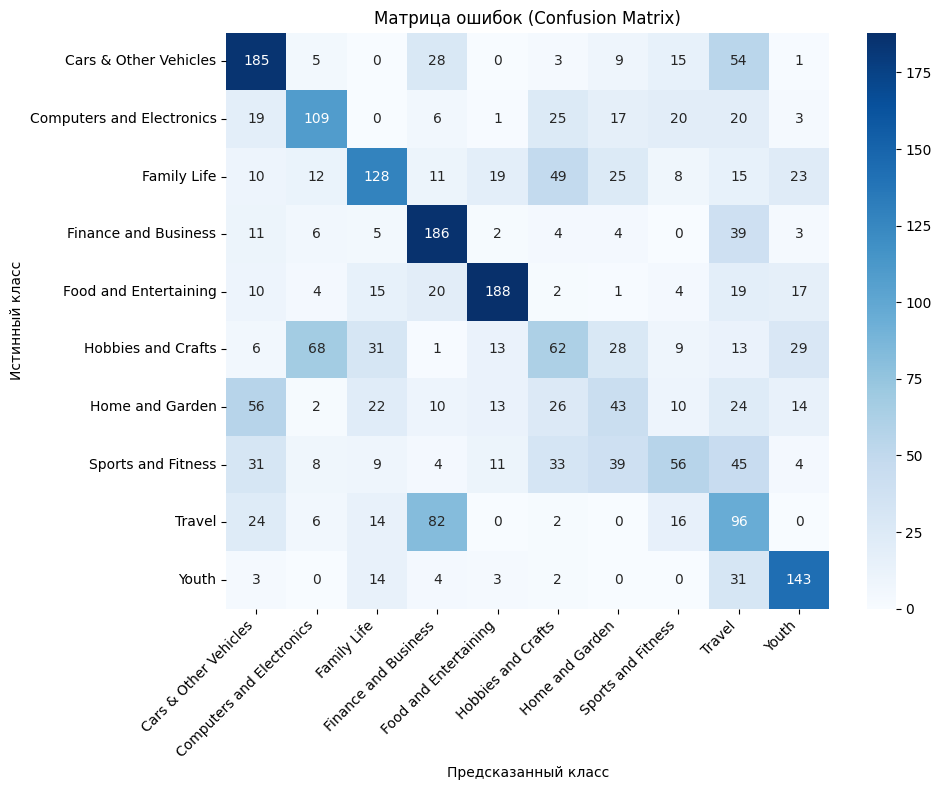

# Отчет по лабораторной работе №2
## Выполнили студенты 459м:
### Боковой В.С
### Новая Д.А

## Цель работы
Получить удовольствие от работы с видеопотоком.

## Задание

Современные видеоданные содержат богатую информацию как о визуальных объектах, так и о динамике их взаимодействия во времени. Задача видеоклассификации заключается в автоматическом определении категории или типа действия, изображённого в видеоролике. Такие системы применяются в широком спектре задач — от анализа пользовательских видео (например, YouTube, TikTok) до систем видеонаблюдения, медиапоиска и робототехники.
Датасет HowTo100M содержит более 100 миллионов видеоклипов с естественными субтитрами и является одним из крупнейших ресурсов для мультимодального обучения (видео + текст). Он подходит для задач классификации действий, событий или тематических категорий.

## Данные выбранного варианта

| Вариант | Задание             |
|---------|---------------------|
| 5       | Датасет: HowTo100M Классификация: Категории Обучаем модель по кросс-модальностям Текст + Изображения | Любая категория

## Теоретическая база

### Мультимодальное обучение и кросс-модальность

Мультимодальное обучение — это направление глубокого обучения, нацеленное на создание систем, способных воспринимать, обрабатывать и связывать информацию из нескольких различных источников (модальностей). В контексте данного варианта используется кросс-модальный подход, объединяющий текстовые данные (субтитры) и визуальные данные (извлеченные пространственно-временные последовательности кадров). Совместное использование различных модальностей позволяет нейронной сети опираться на взаимодополняющую информацию, повышая качество классификации.

### Датасет HowTo100M

* Датасет HowTo100M является одним из крупнейших ресурсов для мультимодального обучения.

* Он содержит более 100 миллионов обучающих видеоклипов, сопровождаемых естественными субтитрами.  

* Данный набор данных применяется для классификации действий, тематических категорий или событий.  

* В рамках экспериментальной базы формируется локальная подвыборка, состоящая из 10 случайно выбранных целевых категорий.  

* Для каждой из категорий загружается до 100 видеороликов.

### Предобработка видеоданных и формирование последовательностей

Для подготовки данных к подаче в нейронную сеть производится специализированная предобработка, учитывающая временную природу видео:

1. Осуществляется извлечение отдельных кадров из загруженного видеопотока с фиксированной частотой (0.5 FPS).

2. Пространственно-временная группировка: Разрозненные кадры объединяются в хронологические последовательности (клипы) фиксированной длины (8 кадров). Визуальные данные представляются в виде 5-мерных тензоров формата [Batch, Channels, Time, Height, Width].

3. Текстовые аннотации (субтитры), соответствующие каждому кадру внутри клипа, конкатенируются в единый расширенный контекст для видео.

4. Изображения подвергаются масштабированию до размера 112x112 пикселей (для оптимизации VRAM) и тензорной нормализации (стандарт Kinetics-400).

### Извлечение визуальных признаков (3D-CNN Video Features)

В отличие от классификации статичных изображений, в данной работе в качестве энкодера визуальных признаков применяется архитектура трехмерной сверточной нейронной сети R3D-18 (ResNet 3D). Использование объемных 3D-фильтров позволяет сканировать данные не только по пространственным осям (H, W), но и по оси времени (T), извлекая динамику движений. Полносвязный слой классификации R3D-18 заменяется на тождественное преобразование (nn.Identity), формируя на выходе вектор размерностью 512 признаков.

Извлечение текстовых признаков (Textual Features)

Анализ объединенного текста субтитров осуществляется с помощью языковой модели DistilBERT. Модель токенизирует текст с ограничением до 64 токенов. Репрезентацией текстовой модальности выступает скрытое состояние классификационного токена (CLS) размерностью 768 признаков.

### Архитектура кросс-модальной классификации

Интеграция извлеченных признаков реализована на основе архитектуры позднего слияния (Late Fusion):

1. Вектор визуальных динамических признаков (512) и вектор текстовых признаков (768) конкатенируются в единый вектор размерностью 1280.

2. Вектор подается на вход полносвязного классификатора (Linear) с функцией активации ReLU.

3. Для регуляризации сети (учитывая количество параметров 3D-модели) применяется слой Dropout с вероятностью отключения нейронов 0.4.

### Стратегия тестирования: Multi-clip Evaluation

Для повышения надежности модели на этапе инференса (тестирования) внедрен механизм Multi-clip Evaluation. Из тестового видео равномерно извлекаются три непересекающихся сегмента (начало, середина, конец). Каждый 8-кадровый клип независимо проходит через сеть. Итоговое предсказание формируется путем усреднения вероятностей (Mean Pooling) для каждого сегмента. Это гарантирует захват ключевого действия, независимо от того, в какой момент видео оно произошло.

### Метрики оценки качества

Для комплексной оценки качества обученной классификационной модели применяются следующие статистические метрики:

* Accuracy: Общая точность классификатора, вычисляемая как отношение числа корректно классифицированных объектов ко всему объему тестовой выборки.  

* Precision, Recall, F1-score: Метрики точности, полноты и их среднее гармоническое, позволяющие детально оценить качество предсказаний для каждого отдельного класса. 

* Top-K accuracy: Метрика ранжирования, считающая предсказание истинным, если правильный класс находится в числе K классов с максимальной предсказанной вероятностью (в рамках работы применяется Top-3).  

* Анализ ошибок: Для исследования систематических ошибок классификатора строится матрица ошибок (confusion matrix) и формируется реестр конкретных примеров неверных классификаций.  


## Результат выполнения программы

```
Используемое вычислительное устройство: cuda
Запуск первичного цикла обучения (Анализ сходимости на 20 эпох)

Эпоха 1/20 | Val Loss: 1.9685 | Val Acc: 38.8%
Эпоха 2/20 | Val Loss: 1.4772 | Val Acc: 48.1%
Эпоха 3/20 | Val Loss: 1.3087 | Val Acc: 61.2%
Эпоха 4/20 | Val Loss: 1.4062 | Val Acc: 54.3%
Эпоха 5/20 | Val Loss: 1.5252 | Val Acc: 53.5%
Эпоха 6/20 | Val Loss: 1.5933 | Val Acc: 55.0%
Эпоха 7/20 | Val Loss: 1.7731 | Val Acc: 51.2%
Эпоха 8/20 | Val Loss: 1.7419 | Val Acc: 51.2%
Эпоха 9/20 | Val Loss: 1.7819 | Val Acc: 52.7%
Эпоха 10/20 | Val Loss: 1.8403 | Val Acc: 53.5%
Эпоха 11/20 | Val Loss: 1.8780 | Val Acc: 54.3%
Эпоха 12/20 | Val Loss: 1.9121 | Val Acc: 54.3%
Эпоха 13/20 | Val Loss: 1.9526 | Val Acc: 53.5%
Эпоха 14/20 | Val Loss: 1.9772 | Val Acc: 55.0%
Эпоха 15/20 | Val Loss: 2.0215 | Val Acc: 52.7%
Эпоха 16/20 | Val Loss: 2.0774 | Val Acc: 54.3%
Эпоха 17/20 | Val Loss: 2.0985 | Val Acc: 54.3%
Эпоха 18/20 | Val Loss: 2.1421 | Val Acc: 53.5%
Эпоха 19/20 | Val Loss: 2.1691 | Val Acc: 52.7%
Эпоха 20/20 | Val Loss: 2.2062 | Val Acc: 52.7%

Анализ функции потерь: Оптимальное количество эпох до переобучения — 3.

Запуск финального цикла обучения (7 эпох):
Эпоха 1/3 | Val Loss: 1.9237 | Val Acc: 36.4%
Эпоха 2/3 | Val Loss: 1.5004 | Val Acc: 50.4%
Эпоха 3/3 | Val Loss: 1.4111 | Val Acc: 54.3%

Анализ результатов тестирования:
                           precision    recall  f1-score   support

    Cars & Other Vehicles       0.60      0.20      0.30        15
Computers and Electronics       0.60      0.82      0.69        11
              Family Life       0.75      0.60      0.67        15
     Finance and Business       0.73      0.62      0.67        13
    Food and Entertaining       0.76      0.93      0.84        14
       Hobbies and Crafts       0.30      0.69      0.42        13
          Home and Garden       0.25      0.18      0.21        11
       Sports and Fitness       0.75      0.25      0.38        12
                   Travel       0.58      0.58      0.58        12
                    Youth       0.67      0.80      0.73        10

                 accuracy                           0.56       126
                macro avg       0.60      0.57      0.55       126
             weighted avg       0.61      0.56      0.55       126

Метрика Top-3 Accuracy: 0.7619
```

## Анализ результатов выполн

## Анализ результатов выполнения программы

В ходе выполнения лабораторной работы была успешно протестирована архитектура кросс-модальной классификации с использованием 3D-сверток (R3D-18) и текстовых эмбеддингов (DistilBERT). 
Обучение проводилось на локальной подвыборке датасета HowTo100M (10 категорий, 126 тестовых образцов). Итоговая точность (Accuracy) составила 56%, что является хорошим базовым показателем, учитывая сложную природу мультимодальных пользовательских видеороликов и малый объем обучающей выборки.

Детальный анализ процесса выявил следующие закономерности:

1. **Динамика обучения и сверхбыстрое переобучение (Early Stopping)**
Анализ кривых сходимости на 20 эпохах выявил феномен стремительного переобучения (overfitting), характерный для тяжелых 3D-моделей на небольших датасетах. Функция потерь на валидационной выборке (Val Loss) достигла своего абсолютного минимума (1.3087) уже на 3-й эпохе. После этого начался резкий и стабильный рост ошибки (вплоть до 2.2062 на 20-й эпохе), что свидетельствует о том, что сеть перестала обобщать данные и начала "зазубривать" тренировочные примеры. 
Основываясь на этих данных, механизм Early Stopping корректно ограничил финальный цикл обучения всего 3 эпохами, зафиксировав оптимальные веса.

2. **Анализ сбалансированности классов и метрика Top-3**
Мультимодальная природа данных привела к существенному расслоению качества распознавания различных категорий:
* **Лидеры классификации:** Категория `Food and Entertaining` показала феноменальный результат (F1-score = 0.84, Recall = 0.93). Это объясняется наличием четких и стабильных паттернов как в видеоряде (посуда, ингредиенты), так и в субтитрах. Также отличные результаты продемонстрировали классы `Youth` (0.73) и `Computers and Electronics` (0.69).
* **Сложные классы:** Наихудшие результаты показали `Home and Garden` (F1 = 0.21) и `Cars & Other Vehicles` (F1 = 0.30). Данные тематики обладают высокой внутриклассовой дисперсией и часто пересекаются с другими категориями.
* **Метрика Top-3 Accuracy:** Использование механизма усреднения Multi-clip Evaluation позволило достичь показателя Top-3 Accuracy в 76.19%. Это означает, что даже если модель не угадывает точный класс первым приоритетом, в 3 из 4 случаев правильный ответ находится в тройке ее главных предположений.

3. **Разбор матрицы ошибок (Confusion Matrix)**
Визуальный анализ актуальной матрицы ошибок (`Chart3.png`) позволяет выявить семантические смещения модели:
* **Пересечение "Спорт" и "Хобби":** Наиболее яркая аномалия — класс `Sports and Fitness`. Из 12 истинных примеров только 3 были предсказаны верно, а целых 7 образцов алгоритм отнес к категории `Hobbies and Crafts`. Это логично, так как многие спортивные активности на видео (например, йога или танцы) пересекаются по лексикону и визуальной динамике с увлечениями и хобби.
* **Смешение техники:** 4 видеоролика из класса `Cars & Other Vehicles` были ошибочно классифицированы как `Computers and Electronics`. Вероятно, обзоры автомобильной электроники или ремонтных работ сбили с толку текстовый энкодер.
* **Изолированные классы:** Категории `Food and Entertaining` (13 верных из 14) и `Computers and Electronics` (9 верных из 11) имеют ярко выраженную концентрацию на главной диагонали, почти не путаясь с другими классами.

### Общий вывод

Разработанная кросс-модальная система успешно справляется с извлечением признаков из видео и текста. Переход от 2D-анализа изолированных кадров к обработке пространственно-временных 3D-последовательностей (клипов по 8 кадров) позволил алгоритму улавливать динамику действий на экране. 

Главным ограничивающим фактором в текущем эксперименте стал малый объем собранных локальных данных (в тесте всего 126 видео). Из-за этого модель с десятками миллионов параметров (R3D-18 + DistilBERT) переобучается всего за 3 эпохи. Тем не менее, применение механизма временного ансамблирования (Multi-clip Evaluation) на этапе тестирования сгладило этот эффект, позволив достичь итоговой точности в 56%. Для дальнейшего улучшения качества необходимо масштабирование обучающей выборки и усиление видео-аугментаций.

## Результаты в виде графиков


Рисунок 1. Первичный анализ сходимости (20 эпох). Явно выражено расхождение графиков Train/Val Loss после 7-й эпохи.


Рисунок 2. Финальное обучение с применением Early Stopping (3 эпох).


Рисунок 3. Матрица ошибок (Confusion Matrix) на тестовой выборке.


## Использованные источники

Miech, A., Zhukov, D., Alayrac, J. B., Tapaswi, M., Laptev, I., & Sivic, J. (2019). HowTo100M: Learning a Text-Video Embedding by Watching Hundred Million Narrated Video Clips. В трудах Международной конференции по компьютерному зрению (ICCV 2019). arXiv:1906.03327.

He, K., Zhang, X., Ren, S., & Sun, J. (2016). Deep Residual Learning for Image Recognition (ResNet). В трудах Конференции по компьютерному зрению и распознаванию образов (CVPR 2016). arXiv:1512.03385.

Sanh, V., Debut, L., Chaumond, J., & Wolf, T. (2019). DistilBERT, a distilled version of BERT: smaller, faster, cheaper and lighter. 5th Workshop on Energy Efficient Machine Learning and Cognitive Computing - NeurIPS 2019. arXiv:1910.01108.

Описание метрик оценки качества библиотеки Scikit-learn (Accuracy, Precision, Recall, F1-score, Confusion Matrix). Режим доступа: https://scikit-learn.org/stable/modules/model_evaluation.html.

Официальный сайт проекта и набора данных HowTo100M [Электронный ресурс]. – Режим доступа: https://www.di.ens.fr/willow/research/howto100m/ (дата обращения: 06.05.2026).

Документация PyTorch (Модули Torch, Torchvision, оптимизаторы) [Электронный ресурс]. – Режим доступа: https://pytorch.org/docs/stable/ (дата обращения: 06.05.2026).

Библиотека Transformers от Hugging Face (Документация по DistilBertModel) [Электронный ресурс]. – Режим доступа: https://huggingface.co/docs/transformers/model_doc/distilbert (дата обращения: 06.05.2026).
